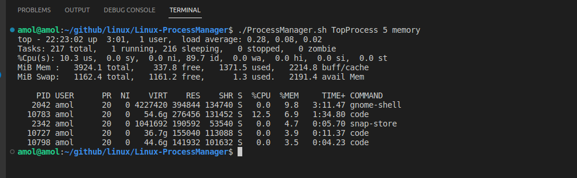
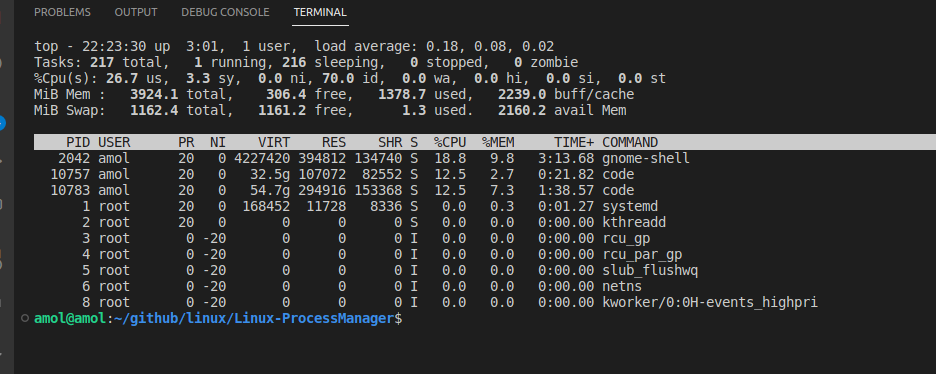
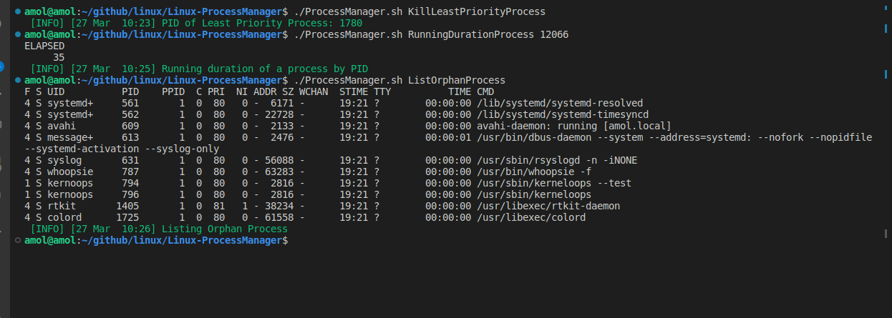
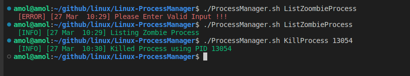
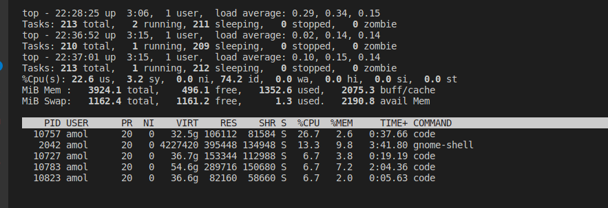

# **Linux Process Manager**


## **<u>Create a utility(ProcessManager.sh) that will be able to</u>** :
- Create a process management utility, to find
   - Top n process by memory
   - Top n process by cpu
   - Kill process having least priority 
   - running duration of a process by name or pid
   - List orphan process if any
   - List zoombie process if any
   - Kill process by name or pid
   - List process that are waiting for the resources

```
i.e.
./ProcessManager.sh TopProcess 5 memory
./ProcessManager.sh TopProcess 10 cpu
./ProcessManager.sh KillLeastPriorityProcess 
./ProcessManager.sh RunningDurationProcess <processName>/<processID>
./ProcessManager.sh ListOrphanProcess
./ProcessManager.sh ListZombieProcess
./ProcessManager.sh KillProcess <processName>/<processID>
./ProcessManager.sh ListWaitingProcess
```






